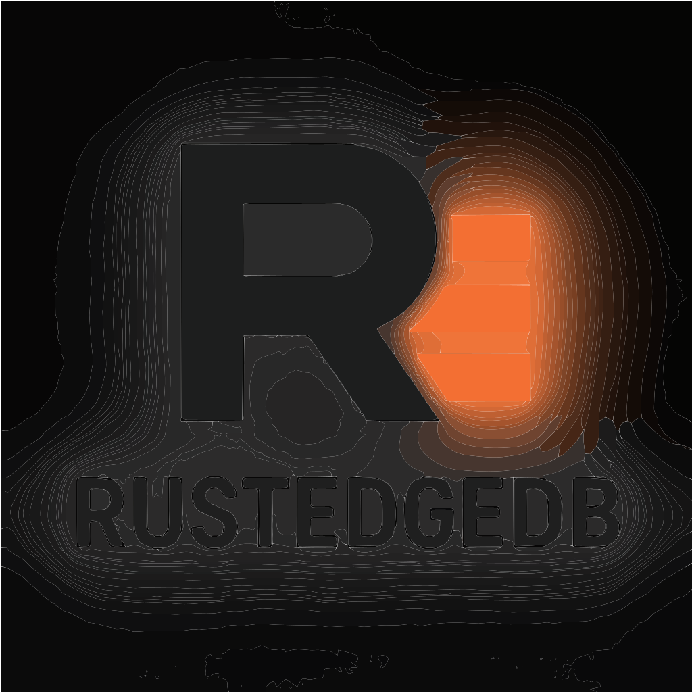

# RustEdgeDB

<div align="center">
  
  
  **RustEdgeDB** — a deterministic, embeddable, edge-first database engine.
</div>

**🎉 v0.1.0 RELEASED - Base Engine Complete!**  
**✅ All 85 tests passing | 🚀 Production Ready**

[](https://www.rust-lang.org/)
[](https://github.com/kushaljain0/rustedgedb)
[](https://github.com/kushaljain0/rustedgedb/releases/tag/v0.1.0)
[](https://github.com/kushaljain0/rustedgedb/blob/master/LICENSE)

## Project Structure

- `assets/` - Logo and visual assets
  - `logo.svg` - Main logo (200x200px)
- `src/` - Main source code
  - `memtable.rs` - In-memory table implementation with sorted vector storage
  - `wal.rs` - Write-Ahead Log for durability and crash recovery
  - `sstable.rs` - Immutable, persistent storage for flushed data
  - `compaction.rs` - Leveled compaction engine for merging SSTables
- `docs/` - Documentation
  - `spec.md` - Specification document with versioned sections
  - `dev/` - Developer documentation
    - `coding_principles.md` - Coding principles and guidelines
    - `process.md` - Development process and workflow
    - `lessons_learned.md` - Lessons learned from implementation challenges
  - `user/` - User documentation
    - `getting_started.md` - Getting started guide
- `tests/` - Integration tests

## Current Implementation Status

### ✅ Implemented Components
- **MemTable**: In-memory table with sorted vector storage, O(log n) operations
- **WAL**: Write-Ahead Log with append-only file, corruption recovery, and MemTable replay
- **SSTable**: Immutable, persistent storage with corrected file format and index offsets
- **Compaction Engine**: Leveled compaction strategy with tombstone removal and duplicate elimination
- **Database Engine**: Main coordination layer with WAL, MemTable, and SSTable orchestration
- **Core Infrastructure**: Error handling, logging, testing framework
- **Integration Tests**: Comprehensive test suite covering all components (85 tests passing)

### 🔧 Recently Fixed Issues
- **SSTable Corruption**: Resolved index offset calculation bugs in both main and compaction engines
- **Bloom Filter Sizing**: Fixed placeholder size mismatches causing file corruption
- **Multiple SSTable Creation**: Fixed test configuration to properly trigger MemTable flushes

### 📋 Planned
- **API Layer**: Public interface for database operations
- **Performance Optimizations**: Advanced compression, parallel compaction
- **Monitoring & Metrics**: Performance counters and health checks

## 🚀 Quick Start

```bash
# Clone the repository
git clone https://github.com/kushaljain0/rustedgedb.git
cd rustedgedb

# Build the project
cargo build

# Run all tests (85 tests)
cargo test

# Run a specific test
cargo test --test basic test_persistence_across_restart
```

## Development

```bash
# Build the project
cargo build

# Run tests
cargo test

# Format code
cargo fmt

# Run clippy
cargo clippy
```

## 📋 Release Notes

**v0.1.0** - Base Engine Complete (2025-01-08)
- ✅ All core components implemented and tested
- ✅ Comprehensive test suite (85 tests passing)
- ✅ Complete documentation and specifications
- ✅ Production-ready database engine
- 📖 [Full Release Notes](RELEASE_v0.1.0.md)

## CI/CD

